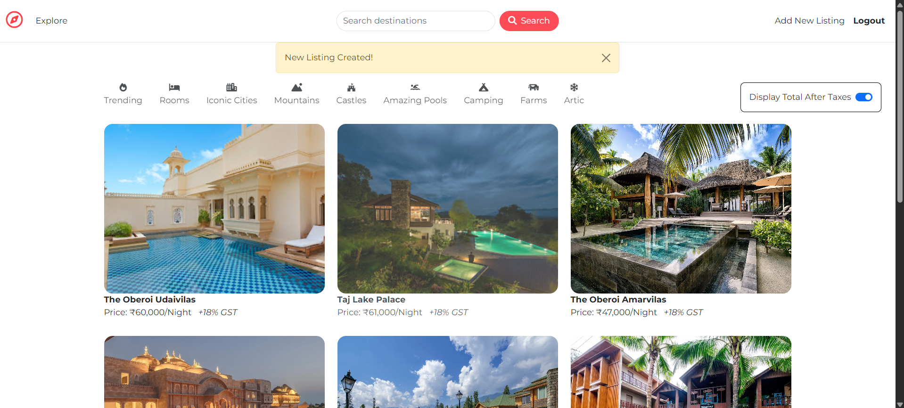

# 🌍 Wanderlust – Travel Listings Web App

[](https://www.npmjs.com/)  
[](https://www.mongodb.com/)  
[](https://render.com/)  
[](https://expressjs.com/)  
[](https://nodejs.org/)  
[](https://developer.mozilla.org/en-US/docs/Web/JavaScript)  
[](https://ejs.co/)

---

Wanderlust is a full-stack web application inspired by Airbnb, built using the **MERN stack** (without React – frontend rendered with **EJS templates**).  
It allows users to browse, create, and manage travel listings with images, pricing, and interactive maps.

🌐 **Live Demo:** 👉 [Wanderlust on Render](https://wanderlust-skz1.onrender.com/listings)

---

## ✨ Features

- 🔑 **User Authentication** with [Passport.js](http://www.passportjs.org/) (Register / Login / Logout)
- 🏠 **Listings CRUD** – Create, Read, Update, Delete listings
- 🖼️ **Image Uploads** with [Multer](https://github.com/expressjs/multer) + [Cloudinary](https://cloudinary.com/)
- 🗺️ **Interactive Maps** powered by [Mapbox](https://www.mapbox.com/)
- 🗄️ **MongoDB Atlas** for database
- ☁️ **Render** for hosting & deployment
- 🎨 **EJS Templating** for server-side rendering
- 🔒 **Secure Sessions & Flash Messages** for better user experience

---

## 🛠️ Tech Stack

**Frontend:**

- EJS (templating engine)
- Bootstrap (UI styling & responsive design)

**Backend:**

- Node.js
- Express.js
- Passport.js (authentication)
- Multer (file uploads)

**Database & Cloud Services:**

- MongoDB Atlas (database)
- Cloudinary (image storage & optimization)
- Mapbox (maps & geolocation)

**Deployment:**

- Render.com

---

## ⚙️ Installation & Setup

1. **Clone the repository**

   ```bash
   git clone https://github.com/your-username/wanderlust.git
   cd wanderlust

   ```

2. **Install Dependencies**

   ```bash
   npm install

   ```

3. **Create a `.env` file in the root directory and add the following:**

   ```env
   CLOUDINARY_CLOUD_NAME=your_cloud_name
   CLOUDINARY_KEY=your_cloudinary_key
   CLOUDINARY_SECRET=your_cloudinary_secret
   MAPBOX_TOKEN=your_mapbox_token
   MONGO_ATLAS_URL=your_mongodb_connection_string
   SESSION_SECRET=your_session_secret

   ```

4. **Run the app**
   ```bash
   nodemon app.js
   ```

Then open: http://localhost:3000

## Project Structure

    ```bash
        wanderlust/
    │── models/          # Mongoose schemas
    │── routes/          # Express routes
    │── public/          # Static assets (CSS, JS, images)
    │── views/           # EJS templates
    │── app.js           # Main server file
    │── package.json
    │── .env             # Environment variables
    ```

## 📸 Screenshot



## Future Improvements

- 💳 Implement booking system with payments
- 👤 User profile management
- 🔍 Advanced search & filtering options

## 👨‍💻 Author

Adithya S

LinkedIn: www.linkedin.com/in/adithya-s-027342237
